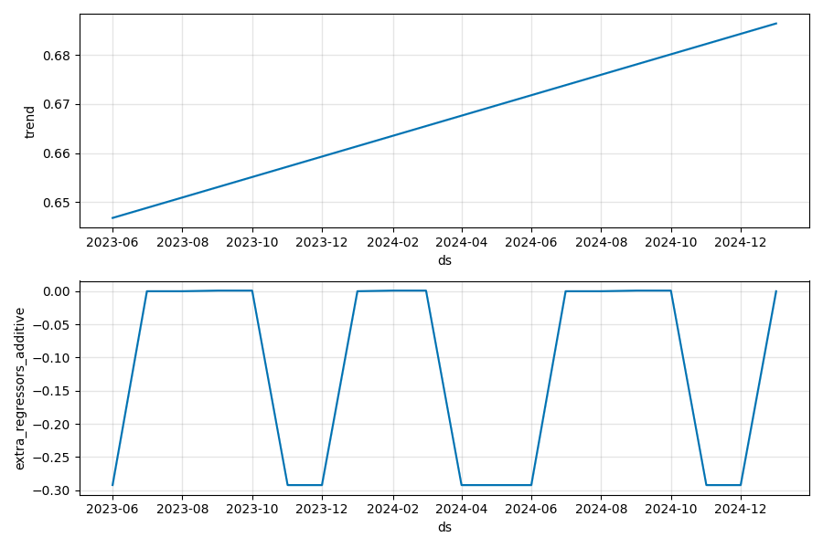
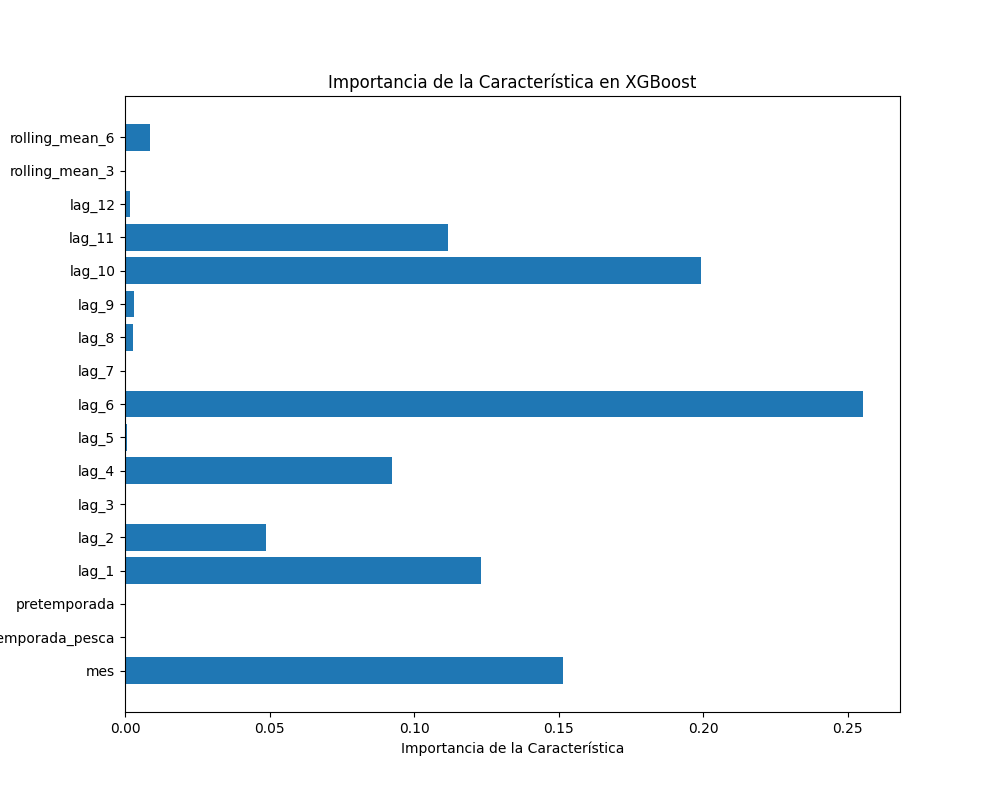
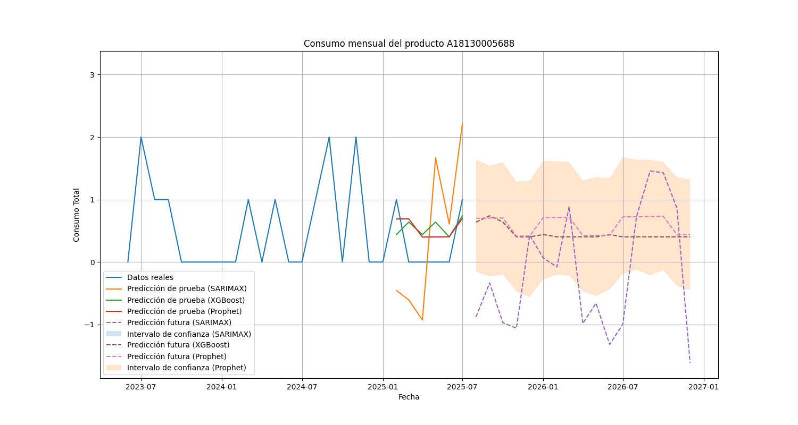

# Análisis Predictivo de Consumo Mensual

## Objetivo

El objetivo de este proyecto es construir un análisis predictivo completo para una serie de tiempo de consumo mensual del producto **A18130005688** desde enero de 2022 hasta octubre de 2025. Se han utilizado tres enfoques predictivos: SARIMAX, XGBoost y Prophet, con el fin de determinar el modelo más preciso para pronosticar la demanda hasta diciembre de 2026.

## Resultados de la Evaluación de Modelos

A continuación, se presenta una tabla con las métricas de error (MAE y RMSE) para cada modelo, tanto en el conjunto de entrenamiento como en el de prueba. El mejor modelo es aquel con el menor error en el conjunto de prueba.

| Modelo    | MAE (Train) | RMSE (Train) | MAE (Test) | RMSE (Test) |
|-----------|-------------|--------------|------------|-------------|
| SARIMAX   | 0.4951      | 0.8306       | 1.0798     | 1.1525      |
| XGBoost   | 0.5133      | 0.5891       | 0.4906     | 0.5094      |
| **Prophet**   | **0.6257**      | **0.7259**       | **0.4184**     | **0.4380**      |

## Conclusión: Selección del Mejor Modelo

El modelo que ha demostrado el mejor desempeño en el conjunto de prueba es **Prophet**, ya que ha obtenido los valores más bajos de MAE (0.4184) y RMSE (0.4380). Esto indica que Prophet es el modelo que mejor generaliza a datos no vistos y, por lo tanto, es el más adecuado para realizar predicciones futuras.

## Gráficos de Diagnóstico

### Prophet: Descomposición de Componentes

Este gráfico muestra cómo Prophet descompone la serie temporal en sus componentes principales: tendencia y estacionalidad anual.

### XGBoost: Importancia de Características

Este gráfico muestra qué características tienen más influencia en las predicciones del modelo XGBoost.

## Fiabilidad de las Predicciones

Aunque el modelo Prophet ha mostrado el mejor rendimiento, es importante tener en cuenta que el conjunto de datos utilizado para el entrenamiento es relativamente pequeño. Esto puede afectar la fiabilidad de las predicciones a largo plazo. Se recomienda seguir recopilando datos y reentrenar los modelos periódicamente para mejorar la precisión de las predicciones.

## Gráfico de Predicciones

A continuación, se muestra un gráfico que compara los datos reales, las predicciones en el conjunto de prueba y las predicciones futuras hasta diciembre de 2026 para los tres modelos. Se incluyen los intervalos de confianza para los modelos SARIMAX y Prophet.

